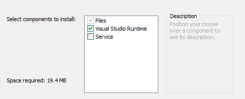
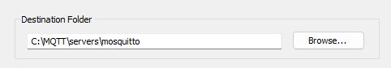
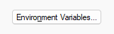
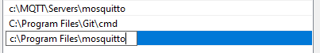
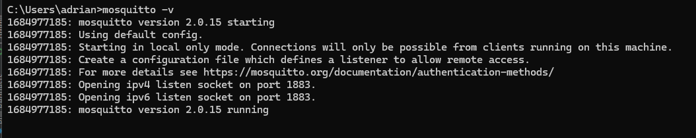

# MQTT Demo with Python

## Mosquitto - the MQTT Broker for development & home use

Get Mosquitto from: https://mosquitto.org/

Download the relevant version of Mosquitto (Windows)
eg: mosquitto-2.0.15-install-windows-x64.exe

- Open the installer
- Click Yes to install
- Click Next
- On the following screen, when you are presented with options to 
  install we DO NOT want to install Mosquitto as a service. 
  If you do, you will need to understand that it is running in the 
  background automatically, and will need you to use the Task Manager
  to stop it. Also it re-runs every time you reboot your PC.
  
- Click Next
- Select where you want to install Mosquitto. Because we work with
  different services, we will often install Mosquitto in a new folder:
  `c:\MQTT\servers\mosquitto` which means we are able to add other 
  services and clients when we want to.
  
- Click Install, and then Finish when you are done.

## Adding Mosquitto to the Path

To add mosquitto to the path so you are able to run it from the command
line anywhere, use the following steps

- Click the Windows start button (or press the Windows Key)
- Type in `env`
- Open the "Edit System Environment Variables" option
- Click on the Environment Variables button 
- Select either the system path (everyone who uses the computer) or 
  user path (just your login)
  
- Click Edit
- Check to see if the path you used in the installer is listed, if not
  - Click on NEW
  - In the dialog box now enter the same path as you installed Mosquitto 
    into. 
  - For example:
    - `c:\MQTT\servers\mosquitto` or
    - `C:\Program Files\mosquitto`
  - This image shows both being added:
    
  - Click OK
- Click on OK
- Click on OK

and you're ready.

NB: If you have PyCharm, WebStorm, Terminal, or other command type 
prompt, you will need to close and reopen them for the above change
to take hold.

## Running Mosquitto

- Open a terminal window in PyCharm, or the CMD prompt or the 
Terminal Application
- Once the terminal is open enter the following command:
- ` mosquitto -v`
- and press Enter

This will run mosquitto in verbose mode, This shows you "logging"
or "debug" messages you are able to see what is happening.

## MQTT and the Internet

MQTT is the Message Queuing Telemetry Transport protocol. It is used
to deliver messages / data from sources to receivers.

It is extensively used in the IoT (Internet of Things) and remote
sensing environments.

The official type of system is known as **PUB**-**SUB**. Where **PUB**
means a publisher, and **SUB** means a subscriber. Publishers send 
data. Subscribers receive data.

To put it in a different way, it is like **Janelle** having a TikTok
account and creating content and putting it onto TikTok.

Other people, *Patricia*, *Hernando*, *Lucy*, *Isabelle* and *Peter*, follow
Jannelle's channel and are automatically told when they have published
new content, and it is sent to their device.

- **Janelle** is the PUBlisher.
- *Patricia*, *Hernando*, *Lucy*, *Isabelle* and *Peter* are SUBscribers.

In fact, MQTT is able to handle many publishers and subscribers at the 
same time, as is shown in the diagram above.

Each publisher is a program that is run on a CPU/Computer, or MCU
(Micro-Controller Unit). Likewise for the subscribers.

MQTT is very lightweight, so it is possible to write code and run it on 
a device such as a ESP-32, Raspberry Pi Pico, or similar.

The applications may serve both Publisher and Subscriber functions by 
acting as a "master controller". For example, in a car-park.

A car-park has one or more entries, and one or more exits. It usually
has displays that give details such as the current time, the 
temperature and most importantly, the number of spaces that are free 
or if the car-park is full.

At the heart of this, there will be a "Car Park Controller" that will
listen to the entry/entries and exits/exits and track spaces that are
available. When this value changes it would publish the new 
information to the displays so they are able to update themselves.

Likewise, a temperature sensor in the car park would send its data to 
the controller, and the controller would update the displays with 
the new information.

Finally, to make sure the displays are in sync with the time, again
the controller could regularly send a message about the current date
and time so the displays are able to make sure they are correct 
(within a second or so).

The diagram above illustrates this, and the process that could be taken.

Here is the possible process summarised:

1) Entry
   1) Car arrives, 
   2) Car Park Entry sends signal “Car Entered”
2) Car Park Controller
   1) Car Park Controller receives message,
   2) Car Park Controller updates spaces left,
   3) Car Park Controller sends signal “update display”
3) Display
   1) Display receives message
   2) Display updates itself
4) Exit
   1) Car departs the Car Park Controller,
   2) Car Park Exit sends message "Car Exited"
5) Car Park Controller (note same as step 2)
   1) Car Park Controller receives message,
   2) Car Park Controller updates spaces left,
   3) Car Park Controller sends signal “update display”

